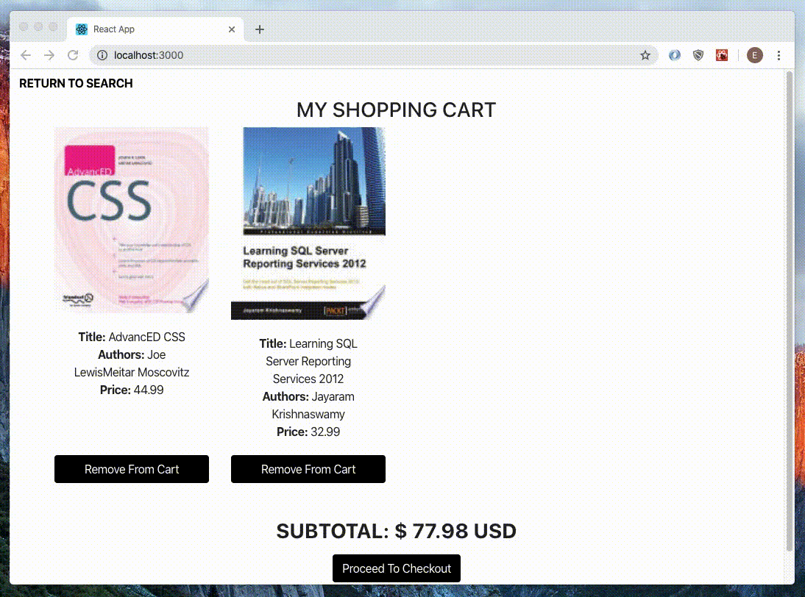
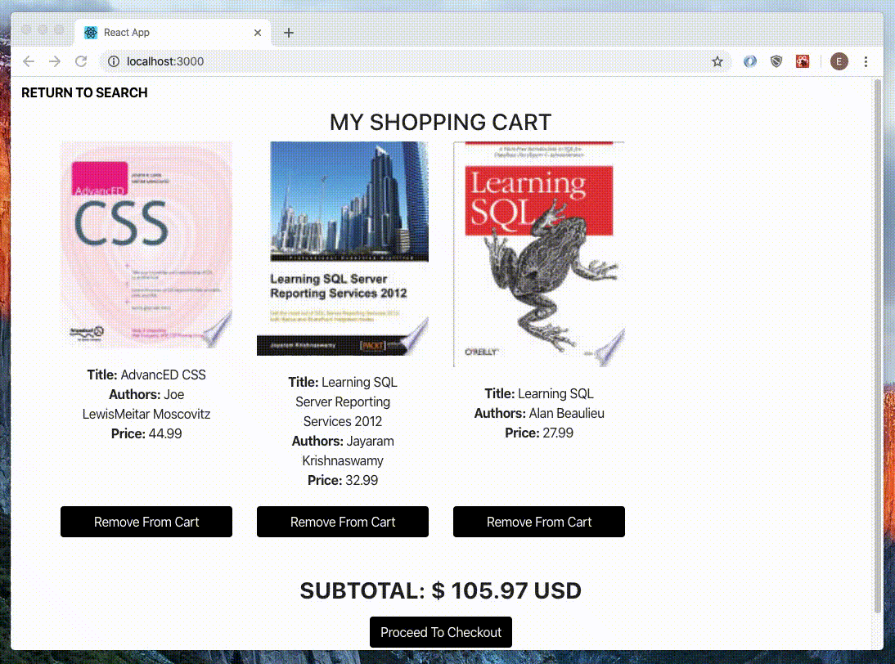

# Bookstore Website
## Overview
This is a fictitious bookstore website. The UI is made with the React JS front-end framework. That React app is contained in the “client” folder. The Express framework is used to define the server routes and the MySQL relational database management system holds the database with the user’s shopping cart items. The client folder is able to communicate with the back-end server.js because in the package.json file in the client folder, there is a “proxy” key that points to the server backend port to listen to.

The fetch API is used to take a user’s book search term from the front end and reach a backend route in the server.js file. That backend route receives the search term from the front end and passes it as an argument to the request() method to retrieve data based on that term from the Google Books API. The new data from Google Books updates the state object in the React app and that new data populates the UI, showing new search results to the user. 

When the user adds a book to their shopping cart, a different route in server.js is accessed. In that route definition, most of the data is accessed using the req.params object. However, the book cover image URL is passed to the backend through req.query instead of req.params (query parameter instead of path parameter) because the image URL contains the “/“ character and so does the route. If a path parameter were used, the “/“ characters in the URL would be interpreted as parts of the route in this app, causing errors.  

Users can search for book titles, add and remove books from their shopping carts, and view the total dollar amounts of their shopping carts.

* Landing Page

## Built With
* Express
* MySQL
* Google Books API
* React
* react-bootstrap
